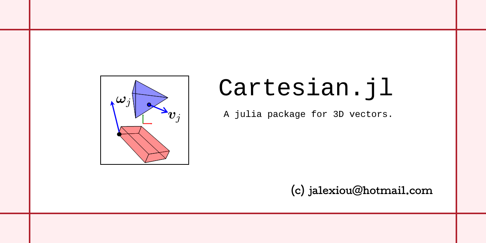

# Cartesian

**Definitions for cartesian vectors and matrices used in 3D mechanics with Julia**. Cartesian vectors are vectors with 3 values, and cartesian matrices are matrices with 3 rows and 3 columns. I use static arrays from the package `StaticArrays` to define the cartesian vectors and matrices as type aliases to immutable `SVector{3}` and `SMatrix{3,3}`. These are compatible with the `Rotations` package also.

Specialized versions of `dot()`, `cross()`, `inv()` and `solve()` are defined which should be faster than the general functions defined for `Arrays`. Additionally predefined constants for common vectors such as the î, ĵ, k̂ unit basis vectors, as well as the common 3×3 identity matrix Î.

The specialized properties `.X`, `.Y` and `.Z` are implemented on vectors, as well as specific matrix elements `.Aij` on matrices. 

The repository is located at https://github.com/ja72/Cartesian.jl

## Dependencies

 - LinearAlgebra
 - StaticArrays
 - Rotations (for future use)

 ## Types & Aliases

The following types aliases are defined as the basis for cartesian vector algebra. Immutable static arrays (SArray) of size 3, or 3×3 of type `Float64`

     const Vector3 = SVector{3, Float64}
     const Matrix3 = SMatrix{3, 3, Float64} 

## Constructors

 - Define a new Vector3 filled with zeros

        Vector()

 - Define a new Vector3 from x,y,z values

        Vector(x,y,z)

 - Define a new Vector3 from a 3×1 vector
        
        Vector(v)

 - Define a new Matrix3 filled with zeros

        Matrix3()

 - Define a new Matrix3 from values by row*

        Matrix(a11,a12,a13, a21,a22,a23, a31,a32,a33)

    (*) This row major layout overrides the column major layout of SMatrix{3,3}

 - Define a new Matrix3 from a 3×3 matrix

        Matrix(A)

## Constants

The following symbols are defined with unit basis vectors and other common values

    const ô = Vector3(0,0,0)
    const î = Vector3(1,0,0)
    const ĵ = Vector3(0,1,0)
    const k̂ = Vector3(0,0,1)
    const Ô = Matrix3()
    const Î = Matrix3(I)

## Properties

Each `Vector3` has the following properties

 - `X` is the first coordinate of the vector. It is defined as `v.X => v[1]`.
 - `Y` is the second coordinate of the vector. It is defined as `v.Y => v[2]`.
 - `Z` is the third  coordinate of the vector. It is defined as `v.Z => v[3]`.
 - `SumSquares` is the sum of squares of the values. It is defined as `v.SumSquares => dot(v,v)`
 - `Magnitude` is the 2-norm of the vector. It is defined as `v.Magnitude => sqrt(dot(v,v))`

Each `Matrix3` has the following properties

 - `Aij` for `i=1..3` and `j=1..3` returning the corresponding element. It is defined as `m.Aij => m[i,j]`

## Functions & Overrides

 - Vector normalization

        normalize(v::Vector3)::Vector3

 - Dot product between two vectors

        dot(a::Vector3, b::Vector3)::Float64
        a ⋅ b => dot(a,b)

 - Cross product between two vectors

        cross(a::Vector3, b::Vector3)::Vector3
        a × b => cross(a,b)

 - Cross product operator matrix from a vector

        cross(a::Vector3)::Matrix3
        ×(a) => cross(a)

 - Double cross product operator matrix from a vector

        cross2(a::Vector3)::Matrix3 => cross(a)*cross(a)

 - Matrix inverse

       inv(m::Matrix3)::Matrix3

 - Solve the system `A*x=b` for `x`

       solve(A::Matrix,b::Vector3)::Vector3
       A\b => solve(A,b)

## Source code

The source code is in the `src\Cartesian.jl` folder.

## Tests

The following statistics from tests in `test\runtests.jl`

 - 26 Total
 - 26 Passed
 - 0 Failed
 - 0 Errors